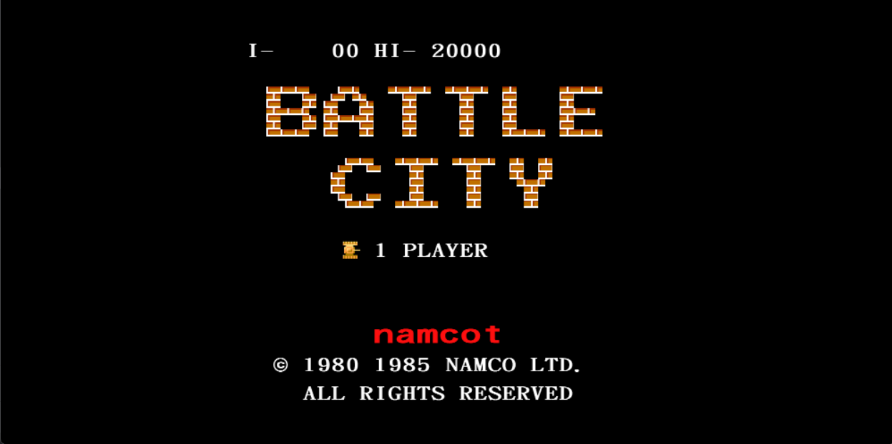
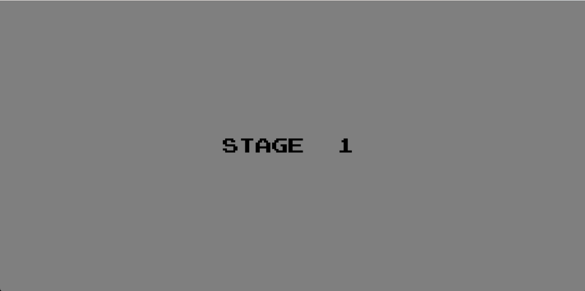
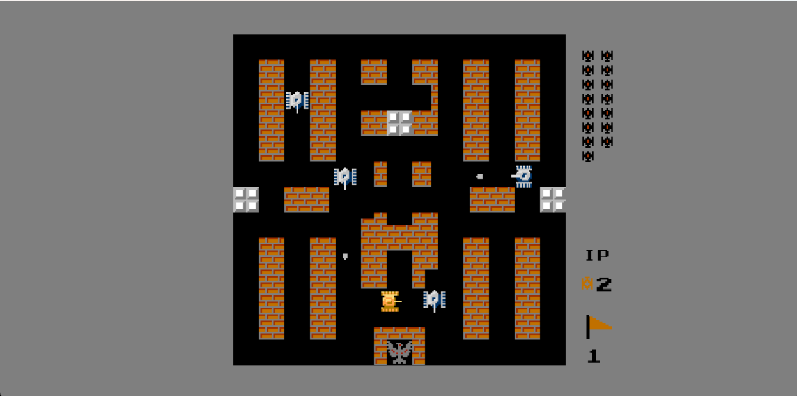
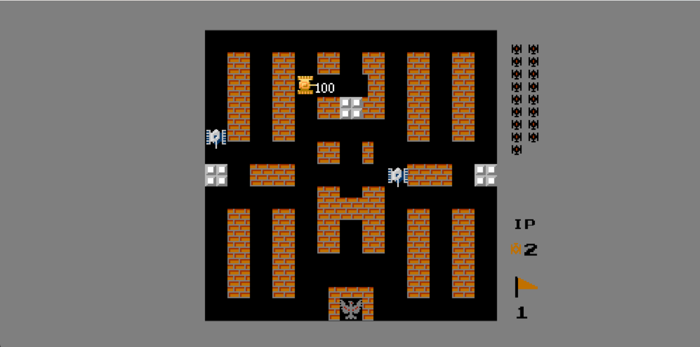
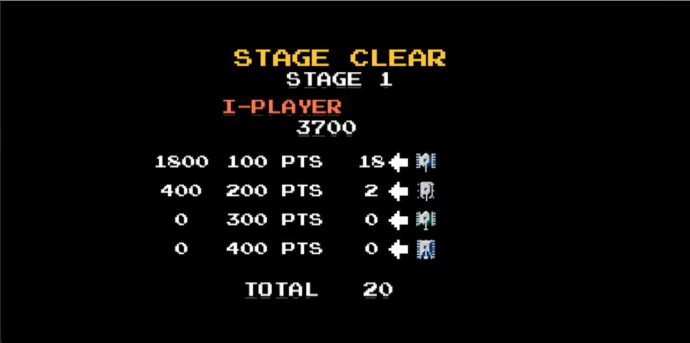
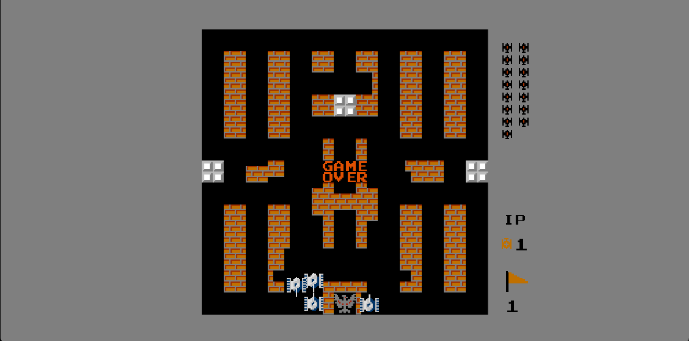

# 2026 OOPL Final Report

## 組別資訊

組別：第五組
組員：張育慎
復刻遊戲：Battle City

---

## 專案簡介

### 遊戲簡介

本專案復刻經典坦克射擊遊戲《Battle City》。玩家操控坦克在關卡中移動、射擊敵方坦克，並保護地圖下方的基地不被敵人破壞。遊戲中包含可破壞磚牆、一般狀態下不可破壞但可被穿甲彈破壞的鋼牆、可以遮蓋坦克的草叢、不可跨越的水域、敵人生成、道具效果、分數彈出顯示、生命值邏輯、關卡切換、結算畫面與 Debug / Cheat Mode 等功能。

本作品的核心目標是盡量還原原版遊戲的玩法邏輯，包含敵人生成順序、磚塊被子彈破壞的方式、玩家升級後的射擊能力、道具效果、敵人擊破分數、關卡結束統計，以及基地被破壞後遊戲結束等機制。

### 組別分工

本組為個人組，因此所有功能皆由本人獨立完成。主要負責內容包含遊戲主流程、玩家控制、敵人系統、地圖系統、碰撞判斷、磚塊破壞邏輯、道具系統、分數系統、HUD、Stage Clear、Game Over、Debug / Cheat Mode、資源整理、除錯與期末影片製作。

---

## 遊戲介紹

### 遊戲規則

玩家使用鍵盤控制 1P 坦克移動與射擊。主要目標是在保護基地的前提下，擊破該關卡中所有敵方坦克。

操作方式如下：

| 按鍵      | 功能                   |
| ------- | -------------------- |
| W       | 向上移動                 |
| A       | 向左移動                 |
| S       | 向下移動                 |
| D       | 向右移動                 |
| Space   | 發射子彈                 |
| F1      | 測試用快速進入結算畫面          |
| F2 ~ F7 | 測試用生成不同道具            |
| F8      | Debug / Cheat Mode，玩家與基地不會死亡 |
| F12     | Game Over 後回到標題畫面    |
| Esc     | 離開遊戲                 |

遊戲通關條件為擊破目前關卡中的所有敵人。若玩家生命數耗盡，或基地被敵人子彈、玩家子彈擊中並摧毀，則進入 Game Over。
在 Debug / Cheat Mode 開啟時，玩家不會受到傷害，基地也不會被摧毀，方便助教或開發者測試關卡與功能。

### 遊戲畫面

本遊戲包含標題畫面、關卡提示畫面、遊戲主畫面、Stage Clear 結算畫面與 Game Over 畫面。

#### 1. 標題畫面

標題畫面顯示遊戲名稱與 1 PLAYER 選單，玩家可從此畫面進入遊戲。



#### 2. 關卡提示畫面

進入關卡前會顯示目前 Stage，讓玩家確認即將開始的關卡。



#### 3. 遊戲主畫面

遊戲主畫面包含玩家坦克、敵方坦克、磚牆、鋼牆、基地與右側 HUD。右側 HUD 會顯示剩餘敵人數量、玩家生命數與目前關卡。



#### 4. 分數彈出效果

敵人被擊破後會顯示對應分數，道具取得時也會顯示 500 分，讓玩家可以直接在地圖上看到得分結果。



#### 5. Stage Clear 結算畫面

通關後會進入 Stage Clear 畫面，統計不同類型敵人的擊破數量、分數與總擊破數。



#### 6. Game Over 畫面

當基地被摧毀或玩家生命數耗盡時，會顯示 Game Over 畫面。




---

## 程式設計

### 程式架構

本專案採用物件導向方式設計，將不同遊戲功能拆分為獨立類別，以降低耦合並方便維護。

主要類別如下：

| 類別               | 功能                |
| ---------------- | ----------------- |
| App              | 控制整體遊戲流程與狀態切換     |
| TitleMenu        | 標題畫面與選單游標         |
| StageIntroScreen | 關卡開始前的 Stage 顯示   |
| StageClearScreen | 關卡結算畫面            |
| StageData        | 儲存關卡地圖與敵人順序       |
| StageHud         | 右側 HUD 顯示         |
| Map              | 地圖載入、座標轉換、地圖物件管理  |
| TileObject       | 地圖物件共同介面          |
| Brick            | 可破壞磚牆             |
| Steel            | 鋼牆                |
| Grass            | 草叢                |
| Water            | 水域動畫與阻擋           |
| Player           | 玩家坦克控制、移動、升級、無敵狀態 |
| Enemy            | 敵方坦克 AI、射擊、死亡處理   |
| Bullet           | 子彈移動、方向、威力        |
| Explosion        | 爆炸動畫              |
| RespawnEffect    | 玩家與敵人的重生動畫        |
| PowerUpItem      | 道具顯示與碰撞           |
| ShieldEffect     | 玩家無敵護盾特效          |
| ScorePopup       | 擊破敵人與取得道具後在地圖上直接彈出分數    |
| Base             | 基地顯示與破壞           |
| GameOverBanner   | Game Over 顯示      |

遊戲主流程由 `App` 控制，並使用 `Phase` 切換不同狀態，例如 `TITLE`、`STAGE_INTRO`、`PLAYING`、`STAGE_CLEAR`、`GAME_OVER`。這樣可以避免所有邏輯混在同一個更新函式中，也方便後續新增功能。

### 程式技術

#### 1. 物件導向設計

本專案採用物件導向方式設計，將遊戲中的不同角色、地圖物件與系統功能拆分成獨立類別，讓每個類別負責自己的資料與行為，降低程式之間的耦合度。

在封裝方面，每個遊戲物件都將自己的狀態與操作封裝在類別內。例如 `Player` 負責玩家位置、方向、生命狀態、升級狀態與無敵狀態；`Enemy` 負責敵人移動、射擊、AI 判斷與死亡流程；`Bullet` 負責子彈方向、速度、威力與是否啟用。外部程式不直接操作這些物件的內部變數，而是透過公開函式進行控制。

在繼承與多型方面，地圖物件使用共同的 `TileObject` 作為基底類別，並由 `Brick`、`Steel`、`Grass`、`Water` 等類別繼承實作。不同地圖物件都可以透過相同介面判斷是否阻擋坦克、是否阻擋子彈，以及被子彈擊中後的反應。這讓 `Map` 與子彈碰撞邏輯不需要知道每一種地圖物件的內部細節，只要呼叫共同介面即可。

例如磚牆 `Brick` 被子彈擊中時，會依照命中位置與子彈方向破壞部分磚塊；鋼牆 `Steel` 在普通子彈撞擊下不會被破壞，但在穿甲彈撞擊後可以被破壞；草叢 `Grass` 不會阻擋坦克與子彈，但會影響畫面顯示；水域 `Water` 則會阻擋坦克但不阻擋子彈。這些物件雖然行為不同，但都可以用相同的地圖物件介面管理。

在組合關係方面，`App` 作為主要控制類別，持有並管理 `Player`、`Map`、`Enemy`、`Bullet`、`PowerUpItem`、`Explosion`、`StageHud` 等物件。遊戲主流程由 `App` 負責切換狀態，而各個物件則負責自身更新與清除。這種設計讓主程式不需要處理每個物件的所有細節，整體架構比較容易維護。

此外，本專案也使用 `std::unique_ptr` 與 `std::shared_ptr` 管理物件生命週期。像是玩家、地圖、敵人、爆炸特效、分數顯示等物件，會在建立時加入 Renderer，並在場景切換或物件消失時呼叫 `Clear()` 移除，避免畫面殘留與記憶體管理錯誤。

整體而言，本專案透過封裝、繼承、多型與組合的方式，將 Battle City 中的玩家、敵人、地圖、子彈、道具與 UI 拆分成明確的物件，使遊戲邏輯更清楚，也更符合物件導向程式設計的精神。

#### 2. 狀態機設計

遊戲使用狀態機管理不同畫面與流程。
例如從標題畫面按下開始後，進入關卡提示畫面，再進入遊戲畫面。當所有敵人被擊破後，進入 Stage Clear；若基地被破壞或玩家生命數耗盡，則進入 Game Over。

此設計讓遊戲流程較清楚，也避免不同畫面的物件互相干擾。

#### 3. 地圖系統

地圖以字元陣列表示，每個字元代表一種地圖物件。例如：

| 字元              | 代表物件     |
| --------------- | -------- |
| `.`             | 空地       |
| `B`             | 完整磚牆     |
| `T`             | 上半磚      |
| `D`             | 下半磚      |
| `L`             | 左半磚      |
| `R`             | 右半磚      |
| `1`、`2`、`3`、`4` | 四種 1/4 磚 |
| `S`             | 鋼牆       |
| `G`             | 草叢       |
| `W`             | 水域       |

`Map` 負責將地圖資料轉換成實際物件，並提供世界座標與地圖格子的轉換功能，讓玩家、敵人與子彈可以正確判斷碰撞。

#### 4. 磚塊破壞邏輯

磚牆是本專案中較複雜的功能之一。為了接近原版 Battle City 的破壞方式，本專案將每個 32x32 的磚塊拆成 4x4，共 16 個 8x8 小區塊，並使用 `m_Solid[4][4]` 紀錄每個小磚塊是否存在。

一般子彈擊中磚塊中心時，會破壞一整排或一整列；若擊中邊角，則只破壞較小範圍。玩家升級到最高等級後，子彈可以一次破壞更大的磚塊範圍，並能破壞鋼牆。

這個設計讓磚牆不再只是單純替換整張圖片，而是可以根據子彈方向與命中位置進行細部破壞。

#### 5. 玩家升級系統

玩家吃到星星道具後會升級，最多升級三次：

| 等級    | 效果            |
| ----- | ------------- |
| 初始    | 普通子彈          |
| 第一次升級 | 子彈速度提升        |
| 第二次升級 | 一次射擊循環可連射兩發   |
| 第三次升級 | 子彈變成穿甲彈，可破壞鋼牆 |

玩家死亡後，升級狀態會重置。若進入下一關但未死亡，則保留目前升級狀態與生命數。

#### 6. 道具系統

遊戲包含原版 Battle City 的主要道具：

| 道具  | 效果             |
| --- | -------------- |
| 碼表  | 暫停敵人移動與射擊 10 秒 |
| 星星  | 提升玩家坦克等級       |
| 鋼盔  | 玩家無敵 10 秒      |
| 手榴彈 | 消滅場上所有敵人       |
| 工兵鏟 | 將基地周圍磚塊暫時變成鋼牆  |
| 坦克  | 增加玩家生命         |

道具由特定敵人死亡後隨機掉落，場上同時只保留一個道具。取得道具後會增加 500 分並顯示分數圖片。

#### 7. 分數與生命系統

擊破不同敵人會獲得不同分數：

| 敵人類型 | 分數  |
| ---- | --- |
| 普通敵人 | 100 |
| 快速敵人 | 200 |
| 強化敵人 | 300 |
| 重型敵人 | 400 |
| 道具   | 500 |

總分每達到 20000 分會額外增加一條生命。分數會一路累積，不會因為切換關卡而重置。

敵人被擊破後，會先播放爆炸動畫，動畫結束後才顯示對應分數約 1 秒。道具分數則會在玩家取得道具時立即顯示。

#### 8. 敵人生成與 HUD

每個關卡有固定敵人順序。敵人會從上方三個生成點依序出現，場上同時存在的敵人數量有限。右側 HUD 會顯示剩餘敵人數量，敵人生成後會逐步減少圖示。

為避免玩家或敵人剛好站在生成點造成卡住，本專案加入了生成碰撞寬限機制：新生成的坦克暫時不與其他坦克發生碰撞，直到完全離開生成區域後才恢復正常碰撞。

#### 9. Debug / Cheat Mode

本專案加入 F8 Debug / Cheat Mode。開啟後玩家不會死亡，基地也不會被摧毀。此功能可用於助教 Demo、測試關卡、測試敵人生成、測試道具與確認通關流程。

#### 10. 記憶體管理

專案中大量使用 `std::unique_ptr` 與 `std::shared_ptr` 管理物件生命週期，並在場景切換時呼叫各物件的 `Clear()` 函式，將已加入 Renderer 的物件移除，避免重複顯示或殘留物件。

此外，圖片資源也加入快取機制，避免相同圖片被重複載入太多次，改善關卡載入速度與資源使用量。


### 使用到 AI/AI Agent 的部分

本專案開發過程中有使用 ChatGPT / AI Agent 作為輔助工具。AI 主要用於協助除錯、設計討論、程式邏輯檢查與報告整理。部分程式架構會先由 AI 提供參考方向，再由本人依照專案實際需求進行修改、測試與整合。

主要使用情境如下：

1. 協助分析 C++ 編譯錯誤與 linker error，例如新增 `ScorePopup` 類別後，需要確認 `.hpp`、`.cpp`、函式宣告、函式實作與 CMake 設定是否一致，避免出現 undefined reference 或重複定義問題。

2. 協助整理物件導向架構，例如將遊戲功能拆分成 `Player`、`Enemy`、`Map`、`TileObject`、`Brick`、`Steel`、`Bullet`、`PowerUpItem`、`StageHud`、`StageClearScreen` 等類別，並討論各類別應該負責的資料與行為，避免所有邏輯集中在 `App` 裡。

3. 協助討論遊戲狀態機設計，例如 `TITLE`、`STAGE_INTRO`、`PLAYING`、`STAGE_CLEAR`、`GAME_OVER` 等階段如何切換，以及在不同階段中應該更新或清除哪些物件，避免畫面殘留或物件重複加入 Renderer。

4. 協助分析地圖系統的程式邏輯，例如如何使用字元陣列表示地圖內容，將 `B`、`S`、`G`、`W` 等字元轉換為磚牆、鋼牆、草叢與水域物件，並讓 `Map` 提供世界座標與地圖格子的轉換功能。

5. 協助檢查磚塊破壞邏輯。原本磚塊只用完整磚、半磚與 1/4 磚圖片切換，無法完整表現原版 Battle City 的破壞方式。經過討論後，改成將 32x32 磚塊拆成 4x4 小區塊，使用 `m_Solid[4][4]` 記錄每個 8x8 小磚塊是否存在，再依照子彈方向、命中位置與子彈威力決定破壞範圍。

6. 協助分析子彈命中空洞的問題。當磚塊被打出缺口後，子彈命中點可能落在已破壞的小區塊中，導致後方剩餘磚塊無法繼續被破壞。解決方向是在磚塊內部加入搜尋實體命中點的邏輯，若目前命中點是空格，則沿著子彈方向繼續尋找下一個仍存在的小磚塊。

7. 協助討論鋼牆破壞邏輯。普通子彈撞擊鋼牆時只會停止與產生爆炸，不會破壞鋼牆；玩家升級到最高等級後，穿甲彈才可以破壞鋼牆。為了讓鋼牆可以表現部分破壞，後續改成以 2x2 mask 記錄鋼牆四個 1/4 區塊是否存在，讓穿甲彈可以根據命中位置破壞半塊或 1/4 塊。

8. 協助分析玩家移動與碰撞問題。原版 Battle City 的坦克移動較接近格線對齊，因此在玩家上下移動時需要協助 X 座標對齊格線，左右移動時協助 Y 座標對齊格線，避免玩家轉彎時卡牆。除此之外，也將玩家對地圖的碰撞判斷改為掃描整個坦克碰撞矩形，避免玩家進入只打掉一排磚塊形成的窄縫。

9. 協助討論敵人生成與碰撞卡住問題。當敵人剛生成時，如果玩家或其他敵人剛好站在生成點附近，容易造成坦克重疊或卡住。解決方式是加入生成碰撞寬限機制，讓新生成的坦克在離開生成區域前暫時不與其他坦克碰撞，完全離開後再恢復正常碰撞。

10. 協助檢查敵人生成、敵人數量限制與 HUD 顯示邏輯。每個關卡有固定敵人順序，敵人從上方三個生成點依序出現，場上同時存在的敵人數量有限。右側 HUD 的敵人圖示會依照剩餘敵人數逐步減少。

11. 協助檢查道具、分數與生命系統。例如星星提升玩家等級、鋼盔給予無敵、手榴彈消滅場上敵人、工兵鏟保護基地、坦克增加生命，以及擊破敵人與取得道具後顯示分數圖片。也協助檢查總分每達到 20000 分時增加生命的邏輯。

12. 協助整理 Debug / Cheat Mode 的設計。按下 F8 後，玩家不會死亡，基地也不會被摧毀，方便測試關卡、道具、敵人生成與 Stage Clear 流程。此功能主要用於開發與助教 Demo，不影響正常遊玩流程。

13. 協助整理期末報告內容與影片展示順序，例如先正常遊玩完整一關，再於第二關使用測試按鍵展示道具、Debug / Cheat Mode 與快速結算功能。

AI 工具主要用於輔助除錯、邏輯討論與文件整理。最終程式仍由本人自行理解、修改、測試與整合。


---

## 結語

### 問題與解決方法

#### 1. 磚塊破壞邏輯過於複雜

一開始使用整張圖片替換的方式處理磚塊，例如完整磚、半磚與 1/4 磚。但這種方法無法完整表現原版 Battle City 中細緻的破壞方式，例如子彈打中中心時應該消掉一整排，也就是四個 8x8 的小區塊，而不是直接變成固定半磚。

解決方法是將每個磚塊拆成 4x4 的小區塊，並以布林陣列記錄每個 8x8 小磚塊是否存在，再依照子彈方向、命中位置與子彈威力決定破壞範圍。這讓磚塊破壞更接近原版遊戲。

#### 2. 子彈命中空洞後無法繼續破壞剩餘磚塊

在磚塊被打出缺口後，子彈中心點可能剛好落在空洞中，外層碰撞範圍仍然保留原本 32x32 的方塊大小，但內部部分小磚塊已經被破壞。當子彈命中點剛好落在已被破壞的小區塊上時，程式雖然偵測到子彈進入磚塊範圍，卻沒有正確破壞後方仍存在的小磚塊，導致剩餘磚塊變得難以繼續消除。

解決方法是在 `Brick` 內部加入尋找實體命中點的邏輯。如果子彈目前命中點是空格，就沿著子彈方向繼續搜尋下一個仍存在的小磚塊，讓子彈可以繼續破壞同一個磚塊中的剩餘部分。

#### 3. 生成點卡住問題

當敵人或玩家生成時，如果其他坦克剛好停在生成點，會造成雙方卡住。

解決方法是加入生成碰撞寬限機制。坦克剛生成時暫時不與其他坦克碰撞，直到完全離開生成區域後才恢復正常碰撞。

#### 4. 護盾特效第一幀位置錯誤

玩家無敵護盾剛建立時，第一幀可能會先出現在預設位置，下一幀才回到玩家身上。

解決方法是在護盾 `Init()` 與 `SetVisible(true)` 時先同步玩家位置，再顯示護盾，避免第一幀閃爍到錯誤位置。

#### 5. 地圖載入速度變慢

因為每個磚塊被拆成多個 8x8 區塊的小圖，若每張圖都重複載入，會造成關卡載入變慢。

解決方法是在圖片建立時加入快取，讓相同圖片可以共用資源，降低重複載入成本。

#### 6. 玩家移動與窄縫碰撞問題

一開始玩家移動時容易出現卡牆或鑽進不該進入的窄縫。原因是玩家座標雖然以連續數值移動，但原版 Battle City 的移動較接近格線對齊。當玩家沒有對齊地圖格線中心時，轉彎進入走道會變得困難；而當磚塊只被打掉一排或只剩一排時，如果碰撞判斷不夠嚴格，玩家也可能進入太窄的空間並卡住。

解決方法是在玩家移動時加入格線輔助對齊。當玩家上下移動時，程式會協助將 X 座標慢慢對齊地圖格線；當玩家左右移動時，則協助將 Y 座標對齊地圖格線。除此之外，也將玩家對地圖的碰撞檢查改成掃描整個坦克碰撞矩形，而不是只檢查幾個邊界點。這樣可以避免玩家鑽進只打掉一排磚塊的窄縫，使移動手感更接近原版。

#### 7. 敵人生成與碰撞卡住問題

在敵人生成時，如果玩家或其他敵人剛好站在生成點附近，容易造成坦克互相重疊或卡住，導致敵人無法順利離開生成區域。

解決方法是加入生成碰撞寬限機制。新生成的坦克一開始暫時不與其他坦克發生碰撞，直到完全離開生成區域後才恢復正常碰撞。這樣可以避免敵人生成時被其他坦克卡住，也讓敵人生成流程更穩定。

### 自評

| 項次 | 項目                      | 完成         |
| -- | ----------------------- | ---------- |
| 1  | 完成 Battle City 復刻遊戲基本玩法 | V          |
| 2  | 完成專案權限改為 public         |  V   |
| 3  | 具有 Debug / Cheat Mode 的功能       | V          |
| 4  | 解決專案上所有 Memory Leak 的問題 |  V   |
| 5  | 報告中沒有任何錯字，以及沒有任何一項遺漏    |  V |
| 6  | 報告至少保持基本的美感，人類可讀        | V          |

### 心得

這次專案最大的收穫是實際理解物件導向設計在遊戲開發中的用途。遊戲中有許多不同物件，例如玩家、敵人、子彈、地圖、道具、爆炸與 UI。如果全部寫在同一個檔案中會很難維護，因此我將功能拆成不同類別，讓每個類別負責自己的行為。

開發過程中最困難的部分是磚塊破壞邏輯。原本以為只要切換圖片就可以完成，但實際做下去才發現原版遊戲的破壞方式比想像中細。最後改用 4x4 mask 的方式管理磚塊狀態，才讓破壞效果接近原版。

另一個困難點是遊戲狀態的切換，例如從標題畫面到遊戲畫面、從遊戲畫面到結算畫面、Game Over 後回到標題畫面等。這些流程如果沒有清除物件，很容易造成畫面殘留或重複加入 Renderer。透過 `Clear()` 與 smart pointer 管理後，整體架構變得比較穩定。

整體而言，這次專案讓我更熟悉 C++ 類別設計、物件生命週期、碰撞判斷、遊戲狀態管理與資源管理，也讓我體會到即使是看似簡單的復刻遊戲，背後仍需要許多細節處理。

### 貢獻比例

| 組員     | 貢獻比例 | 說明                                                |
| ------ | ---- | ------------------------------------------------- |
| 張育慎 | 100% | 獨立完成 Battle City 復刻遊戲的程式設計、素材整合、功能測試、除錯、報告撰寫與影片製作 |

## 編譯注意事項

若使用新版 CMake / CLion 重新載入專案時出現以下錯誤：

```text
Compatibility with CMake < 3.5 has been removed from CMake.
```

請在 CLion 的 CMake Options 加入：

```text
-DCMAKE_POLICY_VERSION_MINIMUM=3.5
```

設定位置：

```text
File → Settings → Build, Execution, Deployment → CMake → CMake options
```

加入後請重新 Reload CMake Project。若仍無法正常編譯，可刪除 `cmake-build-debug/` 後再重新 Reload。

## 可選：調整遊戲視窗大小

若遊戲視窗在執行時顯示為 `1280 x 720`，但希望畫面較小、方便展示或錄影，可自行修改 PTSD framework 的 config 視窗設定。

建議調整為：

```text
Width  = 1000
Height = 500
```

此設定僅影響視窗顯示大小，不影響遊戲邏輯、關卡內容、碰撞判定與操作方式。


